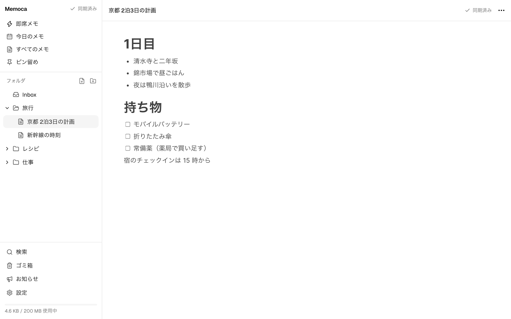
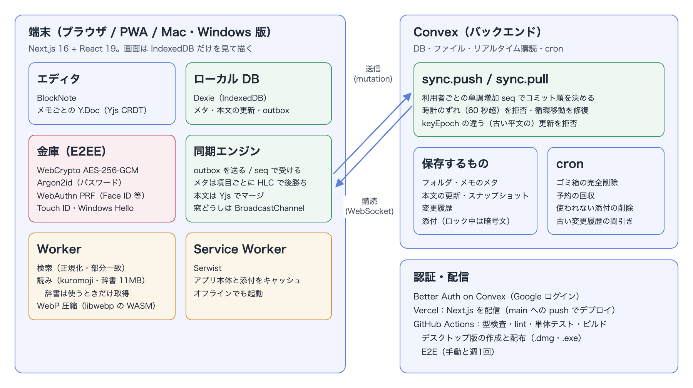
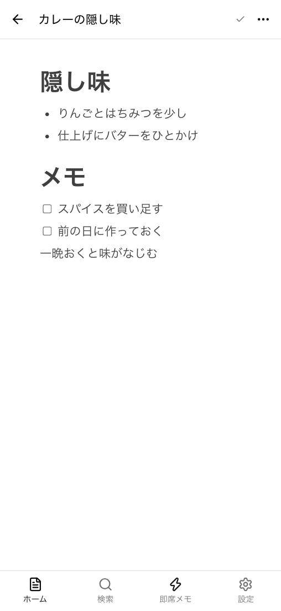
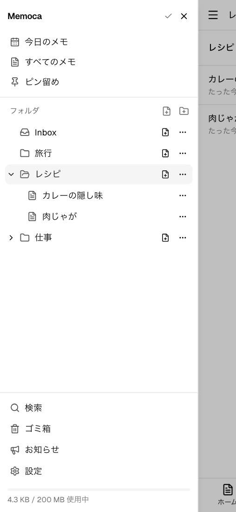
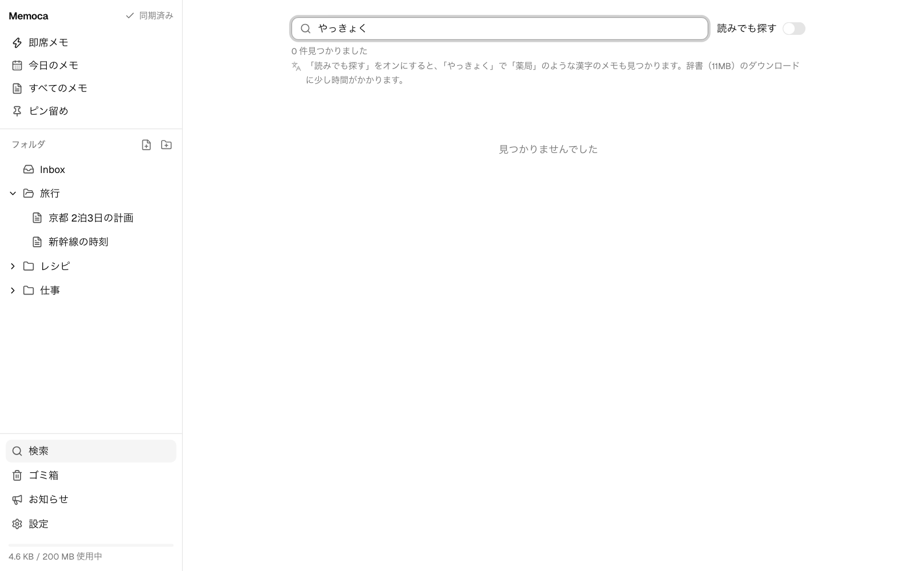
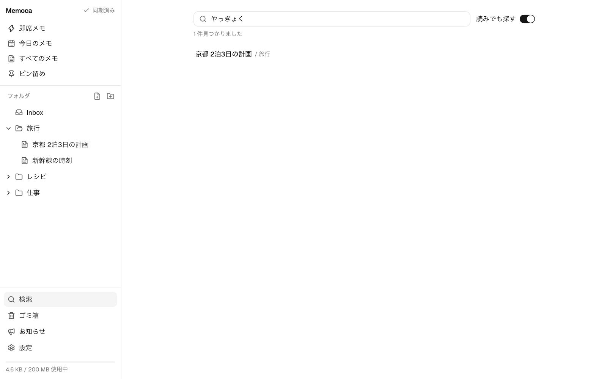
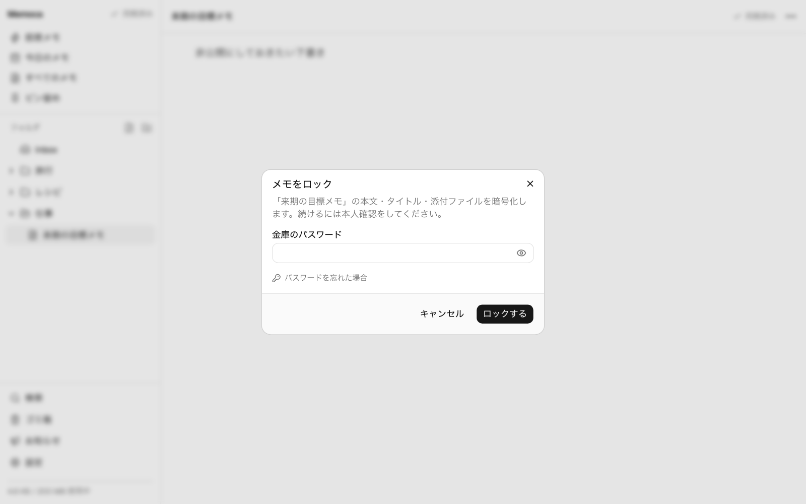
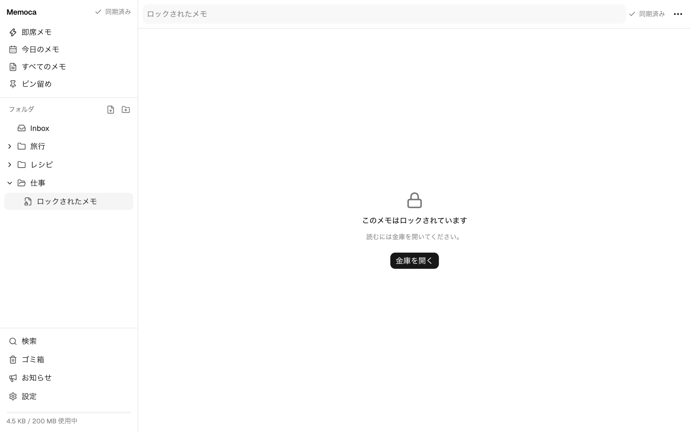

<h1 align="center">Memoca — オフラインでも書ける暗号化メモアプリ<br>作品説明資料</h1>

Notion のようなブロックエディタを備えた、**ローカルファーストのメモアプリ（PWA）** である。PC のブラウザと、ホーム画面に追加した iPhone・Android で同じメモを扱え、**電波の無い場所でも読み書きでき、つながると自動で同期する**。見られたくないメモは端末の中で暗号化してから送る（E2EE）。企画・設計・デプロイ・運用を一人で行い、誰でも登録できる公開サービスとして運用しながら、自分でも毎日使っている。

| 項目 | 内容 |
|---|---|
| 氏名 | 木村 大暉 |
| 区分 | 個人開発（Webアプリケーション／PWA。公開サービスとして運用） |
| ソースコード | https://github.com/mocaluna0117/memoca |
| 実行ファイル（bin） | なし（Webアプリのため exe は無い）。動画と「8. 動作確認方法」のローカルでの起動手順で確認できる |
| 動作紹介動画 | <https://github.com/mocaluna0117/memoca/blob/main/docs/portfolio/memoca-demo.mp4>（約1分10秒） |
| 本番環境 | <https://memoca-app.vercel.app>（Google アカウントで誰でも登録して試せる。ほかの利用者のメモは読めない） |

> 本資料の画面写真と動画は、本番とは切り離した開発用のバックエンドに、**架空のアカウントと架空のフォルダ・メモ**を作って撮影した。金庫（ロック）のパスワードとリカバリーキーも撮影用に作った架空のものである。アプリのコードは本番と同一である。

<p align="center">
  
</p>

---

## 1. 制作意図

メモは「思いついたその場」で書けないと意味が無い。ところが、使っていたメモアプリには次の不満があった。

- **電波の弱い場所で書けない・消える。** 地下や移動中に書いたメモが保存されなかったり、あとで別の端末から開くと古い内容になっていたりする
- **見られたくないメモを預ける先が無い。** サーバーの運営者にも読まれない形で保存したいが、そうすると端末ごとに鍵をどう持たせるかが難しい
- **日本語で探しにくい。** 「薬局」と書いたメモを、変換せずに「やっきょく」と打って探せない。全角と半角、カタカナとひらがなの違いでも見つからない

そこで次の3つを目標にした。

- **オフラインでも同じように書け、2台で別々に書いても、どちらの編集も失わずに1つにまとまる**こと
- **ロックしたメモは端末の外に平文で出ない**こと。そのうえで、パスワード・Face ID・リカバリーキーのどれか1つが残っていれば開けること
- **日本語の読み・表記ゆれで探せる**こと

あわせて、誰でも登録できる公開サービスとして、無料枠の中で運用できる作り（容量の上限・登録の上限）にすることも目的とした。

---

## 2. 開発概要（提出要項の必須項目）

| 項目 | 内容 |
|---|---|
| **開発期間** | 2026年9月17日〜9月30日（14日間）。9月18日から本番で公開し、以降も自分で使いながら改修している |
| **所要時間（概算）** | 約324時間（最初のコミットの2026年9月17日9時57分から、最後のコミットの9月30日22時12分までの経過時間） |
| **開発メンバー数・構成** | 1名 |
| **自身の担当範囲** | 全工程。作る機能と仕様の決定、画面とデータの設計の判断、Convex・Vercel・Google OAuth の本番環境の構築、iPhone・Mac での実機確認と不具合の発見、公開サービスとしての運用 |
| **動作環境** | モダンブラウザ（Chrome / Edge / Safari）。PC・スマートフォン両対応で、ホーム画面に追加すると PWA としてオフラインで起動できる。Mac 向けに、即席メモの小窓をメニューバーから開くデスクトップ版（Tauri）もある |
| **操作方法** | Google アカウントでログインする。左のフォルダを選び、「新しいメモ」で書き始める。本文は `#` と空白で見出し、`-` と空白で箇条書きのように Markdown の記法で書ける。⌘K で検索、⚡（即席メモ）ですぐ書き留める。メモの「…」から「ロックする」で暗号化する（詳しくは「4. 主な機能」） |
| **制作意図** | 1章のとおり。オフラインでも書けて2台の編集が失われずにまとまり、ロックしたメモは端末の外に平文で出ず、日本語の読みで探せるメモアプリを作る |
| **規模** | TypeScript 約24,500行（172ファイル。テストと UI 部品の生成コード 約2,200行を除く）＋ バックエンド（Convex）約6,800行 ＋ デスクトップ版（Rust）約1,400行 ＋ テスト 約19,500行（単体 870件・E2E 35ファイル）。コミット120件 |

---

## 3. 技術スタックとアーキテクチャ

Webアプリの版は `pnpm-lock.yaml`、デスクトップ版の版は `desktop/pnpm-lock.yaml` と `desktop/src-tauri/Cargo.lock` に固定されているものである（`node_modules` に実際に入っている版とも一致することを確かめた）。

| レイヤ | 技術 |
|---|---|
| フロントエンド | **Next.js 16.3.5（App Router / Turbopack）**, React 19.2.8, TypeScript 5.9.3 |
| UI | Tailwind CSS 4.3.3, shadcn 4.21.0（radix-ui 1.6.7）, @dnd-kit/core 6.3.1（ドラッグ＆ドロップ）, zustand 5.0.15 |
| エディタ | BlockNote 0.54.2 ＋ **Yjs 13.6.32（CRDT）**。メモごとに1つの Y.Doc |
| バックエンド | **Convex 1.46.0**（DB・ファイル・リアルタイム購読・cron）, @convex-dev/rate-limiter 0.4.0 |
| 認証 | better-auth 1.6.33 ＋ @convex-dev/better-auth 0.12.5（Google ログイン） |
| 端末内の保存 | **Dexie 4.4.6（IndexedDB）**。画面は常にここから描く |
| 暗号 | WebCrypto（AES-256-GCM・HKDF）, hash-wasm 4.12.0（Argon2id）, WebAuthn PRF（@simplewebauthn/browser 14.0.0） |
| 画像 | Canvas、Safari では @jsquash/webp 1.5.0（libwebp の WebAssembly）で WebP に圧縮 |
| 検索 | 端末内の検索、読みは @sglkc/kuromoji 1.1.0（形態素解析） |
| PWA | @serwist/turbopack 9.5.12（Service Worker） |
| デスクトップ版 | Tauri 2.12.0（@tauri-apps/cli 2.12.0）。macOS 向けの .dmg を作る |
| テスト | Vitest 5.0.1, convex-test 0.0.58, Playwright 1.63.0 |
| 配信・CI | Vercel（main への push で Convex と同時にデプロイ）, GitHub Actions（型検査・lint・単体テスト・ビルド） |

### アーキテクチャ

<p align="center">
  
</p>

- **画面はサーバーを待たない。** 端末の IndexedDB を一次の保存先にし、画面はそこだけを見て描く。書いた内容はまず端末に保存して送信待ちの列（outbox）に積み、同期エンジンが裏で送る。サーバーからの変更も端末に書き込んでから画面に出る。そのため、オフラインでも操作は変わらない
- **サーバーは「順番」を決めるだけにした。** 利用者ごとに1つのカウンタ（seq）を持ち、書き込みのたびに1ずつ進めて行に付ける。端末は「どこまで受け取ったか」をこの番号で覚え、続きだけを受け取る。時刻は端末ごとにずれるので、受け取りの目印には使わない
- **ロックしたメモはサーバーが読めない。** 本文・タイトル・添付は端末で暗号化してから送るため、サーバー側では中身を使う処理（本文のマージや、どのファイルが使われているかの判定）ができない。その分を端末が担う作りにした

---

## 4. 主な機能

### 書く・整理する

- **ブロックエディタ** … 見出し・箇条書き・チェックリスト・トグル・引用・コード・表・画像・動画。`#`・`-`・`[]` などの Markdown 記法や、行頭の「・」で書ける。スマートフォンではキーボードの上にブロックの操作バーを出す（BlockNote の操作部品はマウス前提のため自作した）
- **フォルダ** … 階層は無制限。PC ではドラッグ＆ドロップ、スマートフォンではメニューから移動する
- **即席メモ** … ⚡ボタン・ホーム画面のショートカット・Android の共有から、開いた瞬間に書き始められる。Inbox に入り、あとで整理する
- **画像** … 貼ると端末の中で WebP に圧縮してから送る。貼ったあとでトリミングもできる

<p align="center">
  
  
</p>
<p align="center"><sub>スマートフォンでの表示。左: 編集画面 ／ 右: 一覧。下部のタブから検索・即席メモ・設定を開く</sub></p>

### 探す

- **本文も含めた検索** … フォルダ名・タイトル・本文が対象。全角と半角、カタカナとひらがな、大文字と小文字の違いを吸収する。⌘K のコマンドパレットからも開ける
- **読みで検索** … 設定で有効にすると、「やっきょく」で「薬局」を含むメモが見つかる

<p align="center">
  
  
</p>
<p align="center"><sub>左: 読みで検索が無効のとき、「やっきょく」では何も見つからない ／ 右: 有効にすると、本文に「薬局」を含む「京都 2泊3日の計画」が見つかる</sub></p>

### 守る・戻す

- **ロック（E2EE）** … メモやフォルダをロックすると、本文・タイトル・添付を端末で暗号化する。金庫はパスワード・Face ID / Touch ID・リカバリーキーのどれでも開け、一度オンラインで受け取った端末ならオフラインでも開ける。最後の操作から5分で自動で閉じる
- **ゴミ箱** … 削除はゴミ箱へ移し、復元できる。保持期間（既定30日）を過ぎたものは自動で完全に削除する
- **公開サービスとしての上限** … 1人あたりの容量（既定100MB）、登録人数の上限と招待コード、送信回数の制限

<p align="center">
  
  
</p>
<p align="center"><sub>左: 何をするための本人確認かを見出しと本文で示す ／ 右: ロックした直後。一覧では鍵のアイコンと「ロック中」が付く</sub></p>

### どの端末でも

- **リアルタイム同期とオフライン** … 開いている別の端末へすぐ反映される。オフライン中の作成・編集は、つながったときに送られ、別の端末の編集とまとまる
- **PWA** … ホーム画面に追加すると、電波が無くてもアプリとして起動する
- **Mac のデスクトップ版** … メニューバーやキー操作から、即席メモの小窓をすぐ出せる（Tauri。macOS 向けの .dmg のみ）

---

## 5. 技術的に工夫した点

### (1) オフラインで別々に書いた編集を、失わずに1つにまとめる 🔀

2台の端末がオフラインの間にそれぞれ編集し、あとでつながったときに、どちらの編集を残すかを決める必要がある。「最後に保存した方が勝つ」を1つのメモ全体に当てはめると、片方の編集が丸ごと消える。

- **データの性質ごとに、まとめ方を分けた。** 本文は文字単位で合流できる CRDT（Yjs）に任せ、2台で同じ段落を書き換えても両方の文字が残る。本文以外（タイトル・置き場所・ピン留め・ゴミ箱・ロック）は、**項目のまとまりごとに**「時刻と端末 ID の組が大きい方が勝つ」とした。これで、端末 A での改名と端末 B での移動は、両方とも生きる
- **1つの印を共有していた項目で、編集が消える不具合を直した。** 読みでの検索を作って試していたとき、**本文を書いただけでタイトルが空に戻る**ことがあった。調べると、一覧用の抜粋（本文の冒頭）がタイトルと同じ「勝ち負けの印」を共有しており、本文を書くたびに、少し前に読んだタイトルまで一緒に送り直していた。その間に別の端末で改名されると、古いタイトルで上書きしていた。抜粋に専用の印を持たせ、タイトルを運ばないようにした
- **時計のずれに勝たせない。** 時計が進んだ端末は「後勝ち」で永遠に勝ってしまう。サーバーは現在時刻より60秒以上先の時刻を拒否し、端末はサーバーとの差を覚えて時刻を補正してから送り直す
- **フォルダの循環を直す。** A で「F1 を F2 の中へ」、B で「F2 を F1 の中へ」と移すと、どちらも単独では正しいのに、合わせると輪になる。書き込みは利用者ごとのカウンタで1つずつ順に処理されるので、後から来た移動のときに親を最大64段たどり、輪になるならその フォルダを最上位に付け替える
- **書けなかった編集を捨てない。** iPhone では IndexedDB への書き込みが「接続が切れた」で失敗することがある。当初は、送信待ちの編集をバッファから取り出してから書いていたため、失敗した編集はどこにも残らなかった。しかも後の編集はそれを前提に積み上がるので、Yjs はそれ以降の編集も適用を保留し、**画面には「保存しました」と出たのに、再読み込みすると空**という形で現れた。失敗した編集はバッファの先頭に戻して次の書き込みでまとめて書く、1つのメモの書き込みは順番に1つずつ行う、編集と送信待ちの記録は1つのトランザクションで書く、の3点で直し、書き込みを1回だけ失敗させる単体テストで確かめた
- **1回の失敗で同期が永久に止まる経路を塞いだ。** ゴミ箱から完全に削除したメモを受け取ると、受信処理のトランザクションに含めていない表へ書き込もうとして全体が失敗し、受け取り位置が進まず、同じ所で失敗し続ける不具合を見つけた（送信は動き続けるので気づきにくい）。本番では、まだ完全削除が1件も起きていなかったため表に出ていなかった。表をトランザクションに加え、「完全削除のあとも、別のブラウザで書いたメモが届く」ことを E2E テストで確かめている

### (2) 鍵をサーバーに渡さず、それでも鍵を失わせない 🔐

ロックしたメモは、サーバーの運営者（自分）にも読めない形で保存する。一方で、鍵を失えばメモは二度と開けない。「漏らさない」と「失わせない」の両立が課題だった。

- **鍵を2段にした。** 金庫の鍵（256bit の乱数）が、メモや添付ごとの鍵を包む。金庫の鍵は、パスワード（Argon2id。メモリ64MiB・3回）、Face ID / Touch ID（WebAuthn の PRF 拡張から HKDF で導出）、リカバリーキーの3通りの鍵でそれぞれ包んで保存する。パスワードを変えても包み直すだけで、本文を暗号化し直す必要が無い
- **取り違えを暗号の側で検出する。** AES-GCM の追加認証データ（AAD）に「何の、どのメモの、何代目の鍵か」を入れた。別のメモの暗号文を差し替えられても、復号が失敗する。実際、スナップショットを本文の差分と同じ文脈名で復号しようとしてロックしたメモが空になる不具合が出たが、これは AAD が正しく拒否した結果で、文脈名を直し、2つの文脈が別物であることをテストで固定した
- **ロック後に古い平文が届くのを拒否する。** 別の端末がオフラインの間に書いた平文の編集が、ロックの後に届くと平文が残る。すべての送信に「鍵の代（keyEpoch）」を付け、サーバーは代が違う編集を拒否する。拒否された端末は、差分を新しい鍵で暗号化して送り直す
- **作り直しで見つけた重大な不具合。** 自分が iPhone と Mac で使っていて「ロックするを押すと解除の画面が出る」「Face ID を選ぶと QR コードが出る」と気づいたことをきっかけに、ロック機能を21コミットで作り直した（設計は `docs/LOCK.md`）。コードを調べると、報告より重い問題が見つかった
  - **表示していたリカバリーキーが、すべて使えなかった。** 52文字のキーを4文字ずつ区切って表示する関数が、40文字で切っていた。いまは全文を表示し、最後の4文字を打ち返させて控えたことを確かめる
  - **既存の金庫の鍵を失う経路があった。** 金庫の作成で、サーバーの返事を待たずに新しい鍵を使い始めており、別の端末ですでに金庫がある場合に上書きしうる。サーバーが受け付けてから使い始め、「すでにある」と返されたら新しい鍵を捨てるようにした
  - **ロックしたメモにコピーした画像が、サーバー上で平文のまま残っていた。** 画像はファイルの ID で参照されるため、別のメモからコピーした画像は元のメモのファイルを指したままだった。ロック時に暗号化した複製を作り、複製を指す本文を封じてから送る順にした

### (3) Safari でも画像を小さくし、画質を数値で決める 🖼️

容量は1人100MB なので、画像を端末で圧縮してから送る。ところが Safari（iPhone・iPad・Mac）の Canvas は WebP を書き出せず、スクリーンショットは PNG のまま送られていた。本番の自分のデータを数えると、PNG の画像69枚が、使用量42MB のうち26.7MB を占めていた（WebP の235枚は16.1MB）。

- **Canvas が書けないなら、エンコーダーを持ち込む。** libwebp を WebAssembly にしたもの（281KB）を、画面が固まらないよう Worker で動かした。速度と大きさを比べ、既定より2〜3倍速く、3〜4% 大きいだけの設定（effort 2）を選んだ。実機の iPhone では、写真（3.0MB の JPEG）が136KB に、1枚あたり0.3秒以内でなった
- **縮めると文字がにじむ原因を測って特定した。** スクリーンショットの小さい文字がにじむのは画質ではなく縮小のせいだった。画面と同じ大きさのスクリーンショット11枚と写真19枚で、スマホの表示幅での SSIM（画質の指標）を比べると、長辺2048px に縮めた場合は0.949〜0.975、元の解像度のままなら画質65でも0.983〜0.993 で、容量の増加は11枚の合計で6% だった
- **写真とスクリーンショットを画素で見分ける。** 画像を約6万5千画素に縮めた見本で、横に隣り合う画素がまったく同じ色の割合を測ると、スクリーンショットや図は60〜95%、写真は14% 以下だった。40% 以上をスクリーンショットとして400万画素まで元の大きさで画質65、それ以外を写真として長辺2048px・画質75で書く。写真の画質は82から75に下げると19枚の合計で24% 減り、SSIM は0.976 → 0.971 でほぼ変わらない
- **すでに保存した画像も WebP にし直せる。** 設定から、PNG・JPEG の画像を1枚ずつ WebP にし直す。最初の版は、サーバーが複製を受け取る前にメモの参照を差し替えていたため、途中でアプリを閉じると画像が消えうることをレビューで見つけ、「複製を送る → サーバーが受け取ったのを確かめる → 参照を差し替える → 元のファイルは1週間後に消す」の順にした

### (4) 「やっきょく」で「薬局」を見つける 🔎

Convex の全文検索は日本語を単語に分けられないため、検索は端末の中で行う。全角・半角やカタカナ・ひらがなの違いは正規化（NFKC・小文字化・カタカナをひらがなへ）で吸収したが、**漢字を読みで探す**ことはできなかった。

- **1文字ずつの読みでは足りない。** 漢字1文字ごとの読みの表で作ると、「薬局」は「やく＋きょく」になり、実際に打つ「やっきょく」と一致しない。形態素解析（kuromoji）は単語として「ヤッキョク」と読めるので、こちらを使った
- **読みは端末で作り、どこにも送らない。** メモから取り出した本文の横に読みを保存し、検索で読みにも当てる。ロックしたメモは対象にしない
- **辞書の11MB を全員に配らない。** 辞書をアプリの初回の読み込みに含めると、全員のインストールが数MB 以上重くなり、Service Worker が有効になるまでも遅れた。そこで設定で有効にした人だけがダウンロードし、一度取得したらキャッシュしてオフラインでも使えるようにした。かな で探して何も見つからなかったときに、その場で有効にする案内を出す

### (5) サーバーが読めないメモの、使われなくなったファイルを消す 🧹

画像を消したり差し替えたりすると、使われないファイルが容量を占め続ける。しかしロックしたメモの本文はサーバーでは暗号文なので、サーバーは「どのメモがどのファイルを使っているか」を判断できない。

- **端末が報告し、サーバーは報告の新しさを検査する。** 端末は、手元の写しがサーバーの最新と一致したメモについてだけ、使っているファイルの ID を報告する。報告に「どの版まで見たか」を付け、サーバーの最新と違えば拒否する（追いついていない端末が、別の端末で足したファイルを「使われていない」と報告しないため）
- **消すのは、全部のメモの報告がそろったときだけ。** 30日使われていないファイルでも、まだ報告されていないメモがコピーを使っているかもしれないので、その利用者のすべてのメモ（ゴミ箱の中も）の報告が最新のときだけ消す
- **タブの間の食い違いも見つけて直した。** 同じ端末の別のタブで差し替えた画像が、開いているタブの文書にはまだ入っておらず、「元の画像を使っている」と報告して、新しい画像が30日後に消される経路があった。報告は端末に保存された内容を元に作るようにし、開いている文書だけで作ると失敗するテストを加えた

---

## 6. ゲーム開発のプログラマとして活かせると考える点

Webアプリでありゲームとは領域が異なるが、以下はゲーム開発にも通じる経験だと考えている。

- **別々に進んだ状態を、項目ごとの規則で矛盾なくまとめる設計。** オフラインの2台の編集を、本文は CRDT、それ以外は項目のまとまりごとの後勝ちでまとめ、時計のずれや循環のように「それぞれは正しいのに合わせると壊れる」場合を1つずつ規則にした。オフラインで遊べるゲームのセーブデータを複数の機種で引き継ぐときや、通信が遅れて届く操作を後から整合させるときにも、「何を単位に、どちらを勝たせるか」を先に決める必要があると考えている
- **データ量と見た目の質を、指標で測って配分を決める姿勢。** 画像の圧縮では、画質の数値を感覚で決めず、実際の画像30枚で SSIM と容量を測り、「にじみの原因は画質ではなく縮小」と特定してから設定を決めた。機種ごとに使えない機能（Safari の WebP）は別の経路で補った。容量と描画の制約の中でテクスチャや音声の圧縮形式・解像度を機種ごとに決めるゲームのアセット制作にも、同じ進め方が使える
- **改ざんや取り違えを「検出できる形」でデータを持つこと。** 暗号文に「何の、どのメモの、何代目の鍵か」を結び付け、差し替えや古いデータの混入を、復号の失敗や代の不一致として必ず検出できるようにした。セーブデータや通信データを改ざんから守るときも、「おかしなデータを受け取ったら確実に気づく」形にしておくことが基本になると考えている
- **日本語の文字を、人が打つとおりに扱うこと。** 全角と半角、カタカナとひらがな、漢字の読みの違いを吸収して、利用者が思い浮かべたとおりの打ち方で見つかるようにした。図鑑やアイテムの検索、名前の入力など、ゲームの中で日本語を扱う機能にも活かせる

---

## 7. AI利用箇所の明記

> 提出要項「※AIを利用したアセット・コードが含まれる場合は、利用箇所を具体的に明記してください」に基づく記載である。

### 開発でのAIの利用

本作品の開発では、AIコーディングエージェント **Claude Code（Anthropic）** を全面的に使用した。**マージを除くコミット120件のうち119件に、AIが共同作成者として記録されている。** 残りの1件は、Next.js の雛形を作るツール（create-next-app）が生成した最初のコミットである。**自分が手で書いたコードは無く、コードはすべてAIが生成したもの**である。

- **自分が担ったこと**: 作る機能と仕様の決定（決めた事項は `docs/PLAN.md`・`docs/LOCK.md` などに記録されている。例: ロックの鍵の階層を保つ、フォルダ名は暗号化しない、写真の画質を75にする）、AIの提案の採否、iPhone・Mac での実機確認と不具合の発見（「ロックするを押すと解除の画面が出る」などの報告がロック機能の作り直しのきっかけになった）、Convex・Vercel・Google OAuth の本番環境の設定、公開サービスとしての運用
- **AIが担ったこと**: 設計の下書きと調査、実装コード・テスト（単体・E2E）の生成、不具合の原因調査、手順書（`docs/` 以下）・README・コミットメッセージの作成。本資料に載せた測定値（SSIM・容量・処理時間）の多くも、AIが測定用のスクリプトやアプリの診断欄で計測したものである。また、AIによるコードレビューで見つかった問題（画像の差し替えの順番、タブの間の食い違いなど）も直した

### アプリの中でのAIの利用

なし。アプリの機能として生成AIは使っていない（読みでの検索に使う kuromoji は辞書に基づく形態素解析で、生成AIではない）。

### 本資料でのAIの利用

- **画面写真と架空のデータ**: Claude Code がブラウザ自動操作ツール（Playwright）で、開発用のバックエンドに架空のアカウント・フォルダ・メモを作って撮影した。金庫のパスワードとリカバリーキーも撮影用の架空のものである
- **構成図**: Claude Code が作成した
- **本資料の文章**: Claude Code が、ソースコード・`docs/`・git の履歴を読んで下書きし、内容を自分で確認・修正した
- **デモ動画**: Claude Code が Playwright で操作・録画し（マウスカーソルは録画に映らないため、疑似カーソルを描いた）、ffmpeg で場面を切り出して見出しカードとつないだ。見出しカードも Claude Code が作成した

---

## 8. 動作確認方法

### 動画で確認する

`memoca-demo.mp4`（約1分10秒）に、メモを書く → PC をオフラインにして編集し、スマホの編集とまとまる（PC とスマホの画面を並べて同時に録画）→ 読みで検索 → ロックと金庫を閉じる、までを収録している。

### 本番環境で試す

<https://memoca-app.vercel.app> を開き、Google アカウントでログインすると、そのまま使える。ホーム画面に追加すると、機内モードでも起動して読み書きできる。

### ローカルで動かす

Webアプリのため、Windows の実行ファイル（exe）は用意していない。バックエンド（Convex）も手元のパソコンの中だけで動かせるので、アカウント登録なしで試せる。

```bash
# 前提: Node.js 24、pnpm 10
pnpm install
CONVEX_AGENT_MODE=anonymous pnpm dev:convex   # Convex をローカルで起動（初回のみ設定の質問あり）

# 別のターミナルで、初回だけ設定を入れる
npx convex env set BETTER_AUTH_SECRET "$(openssl rand -base64 32)"
npx convex env set SITE_URL http://localhost:3100
npx convex env set ALLOW_PASSWORD_AUTH true   # テスト用のメールとパスワードのログイン
npx convex env set MAX_USERS 100000

pnpm dev    # http://localhost:3100
```

`ALLOW_PASSWORD_AUTH` は、Google ログインの設定なしで開発と自動テストを回すためのもので、本番では設定していない。

### テストを動かす

```bash
pnpm test   # 単体テスト（Vitest）: 79ファイル・870件
pnpm e2e    # E2E テスト（Playwright）: Convex と開発サーバーを起動しておく
```

2026年9月30日に手元で実行し、単体テストは **79ファイル・870件すべて成功**した（約56秒）。E2E テストは296件（PC・スマホ・小窓の3種の画面 × 35ファイル）のうち **222件が成功、73件は画面の種類ごとに対象外として意図的に外しているもの（スマホ専用の操作を PC で飛ばすなど）** で、失敗は0件だった。ただし1件は1回目に失敗し、設定どおりの再試行で成功した（小窓を閉じる操作のタイミングによる不安定なテスト。約20分30秒）。

---

## 9. リポジトリ構成（抜粋）

```
memoca/
├── src/
│   ├── app/                    # 画面（ワークスペース・即席メモ・設定・ログイン）と Service Worker
│   ├── components/             # エディタ・フォルダツリー・金庫・検索などの部品
│   └── lib/
│       ├── sync/               # 同期エンジン（outbox・受信・Yjs の保存と送信）
│       ├── db/                 # 端末内の保存（Dexie）
│       ├── hlc.ts              # 後勝ちの比較（サーバーと同じ規則）
│       ├── crypto/             # 暗号（AES-GCM・Argon2id・パスキー・リカバリーキー）
│       ├── vault/              # 金庫とロック（本人確認の状態遷移・修復）
│       ├── media/              # 画像の圧縮・見分け・WebP 化・使用中ファイルの報告
│       └── search/             # 検索の正規化と読み
├── convex/                     # バックエンド（スキーマ・同期・金庫・添付・ゴミ箱・cron）
├── desktop/                    # Mac のデスクトップ版（Tauri）
├── tests/                      # 単体テスト（Vitest）
├── e2e/                        # E2E テスト（Playwright）
├── docs/                       # 計画（PLAN.md）・ロックの設計（LOCK.md）・デプロイ手順 ほか
└── docs/portfolio/             # 本資料と画像
```
